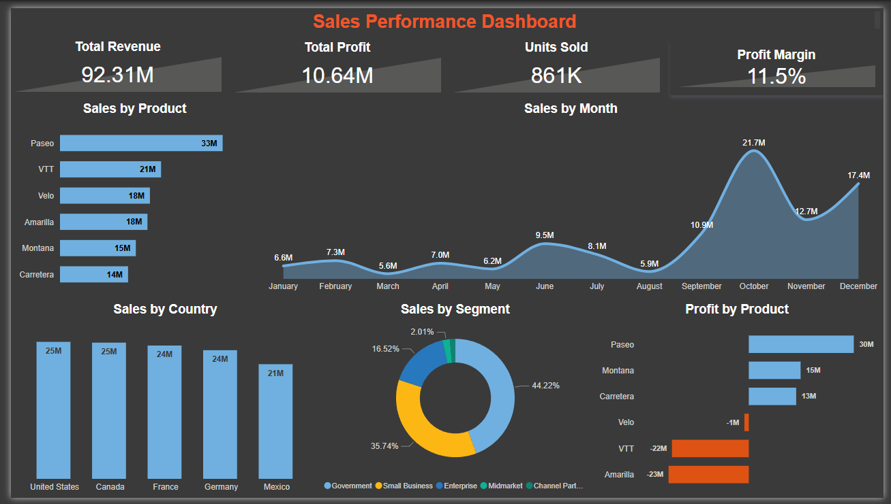

# Sales Performance Dashboard

## Overview
This project is a Power BI dashboard that analyzes business performance based on sales, profit, and customer segments.

## Key Insights
- Total Revenue: 92.31M
- Total Profit: 10.64M
- Profit Margin: 11.5%
- Units Sold: 861K

## Dashboard Features
- Sales trend analysis (Monthly)
- Product-wise sales performance
- Country-wise sales distribution
- Segment-wise contribution
- Profit vs Sales comparison

## Tools Used
- Power BI
- DAX
- Data Modeling

## Dashboard Preview

